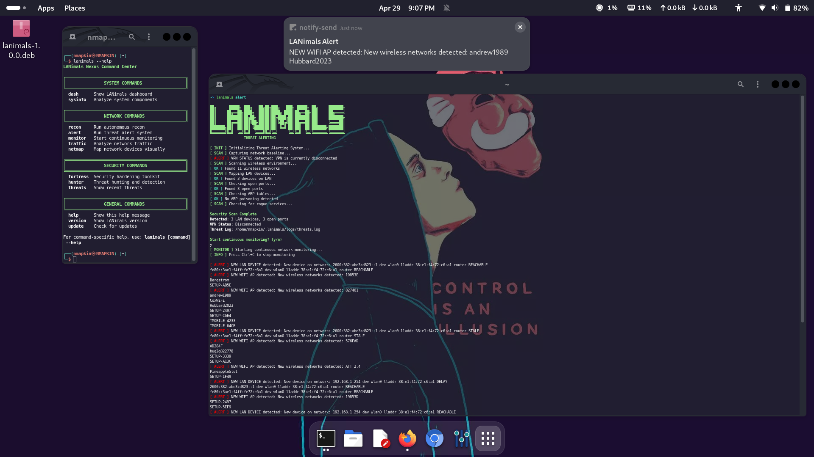

   




# LANimals — Real-time Network Intelligence Suite

[](https://github.com/GnomeMan4201/LANimals/actions)
[](SECURITY.md)
[](LICENSE)
[](https://github.com/GnomeMan4201/LANimals)
[](https://github.com/GnomeMan4201/LANimals/commits/main)

---

## summary
LANimals is a lightweight, production-oriented network reconnaissance suite for real-time device discovery, fingerprinting, and intelligence on local networks.

---

## Quick Start 
> Run LANimals only on networks you own or have explicit permission to test.

```bash
# Clone the repo
git clone https://github.com/GnomeMan4201/LANimals.git
cd LANimals

# Run the automated quickstart
./quickstart.sh

> The quickstart.sh script will create a virtual environment, install dependencies, and run a demo scan on a safe local subnet.


---

Highlights & Use Cases

Key capabilities

Host discovery across IPv4 local ranges (ARP, ICMP, and TCP probes)

Device categorization (printers, routers, cameras, workstations, IoT)

Service and OS fingerprinting with confidence scores

Live visualization dashboard (local web UI) and exportable reports (JSON/CSV)

Lightweight agent mode for constrained devices


Practical use cases

Rapid internal reconnaissance for incident response and validation

Asset inventory for small office / lab networks

Red team reconnaissance in permitted engagements (laboratory/target scope)

Defensive testing to tune IDS/endpoint detection rules


---

Example Commands

Run a standard discovery and print a brief summary:

python -m lanimals.scan --net 192.168.1.0/24 --summary

Run a verbose scan and save full JSON report:

python -m lanimals.scan --net 10.0.0.0/24 --verbose --output reports/local_scan.json

Start the local visualization dashboard:

python -m lanimals.ui --data reports/local_scan.json --host 127.0.0.1 --port 8080

Run a headless agent on a constrained host:

python -m lanimals.agent --mode collect --out agent_upload.tar


---

Architecture (high-level)

LANimals/
├─ docs/                  # Design notes, API docs, visualization docs
├─ src/
│  ├─ lanimals/
│  │  ├─ scan.py          # Discovery engine
│  │  ├─ fingerprint.py   # Device/service classification logic
│  │  ├─ reporters.py     # JSON/CSV exporters and summaries
│  │  ├─ ui.py            # Lightweight web UI for visualization
│  │  └─ agent.py         # Constrained-host agent logic
├─ examples/              # Example configs & demo scripts
├─ tests/                 # Unit & integration tests
├─ configs/               # Default scan/report configs
└─ README.md

Design principles

Modular discovery engine — plug in new probes without changing core flow

Deterministic fingerprint scoring — combine network, protocol, and metadata signals into explainable confidence levels

Minimal external dependencies — suitable for single-board computers and VM-based labs


---

Configuration

Default configs live in configs/. Example config options:

probe types (ARP, ICMP, TCP)

timeout and retry settings

output formats (JSON, CSV)

fingerprint confidence thresholds


Place custom configs in configs/ or pass --config path/to/config.yml.


---

Installation & Development

1. Create and activate a Python virtual environment:


python -m venv venv
source venv/bin/activate

2. Install dependencies:


pip install -r requirements.txt

3. Run the test suite:


pytest -q

4. Run linters and formatters:


ruff check src tests
black src tests


---

Security & Responsible Use

LANimals is intended for authorized testing, research, and defensive validation only.
Do not run scans against networks you do not own or have explicit permission to test.
See SECURITY.md for responsible disclosure and reporting procedures.


---

Contributing & Code of Conduct

Contributions are welcome:

Open issues for feature requests or bugs (include logs and minimal repro steps)

PRs should include tests or rationale for research/experimental code

Maintain backward compatibility and document breaking changes

Follow CODE_OF_CONDUCT.md


Suggested repo files: CONTRIBUTING.md, CODE_OF_CONDUCT.md, SECURITY.md.


---

Tests & CI

CI runs unit tests and integration checks

Add tests for new fingerprinting heuristics and reporters

Example datasets in tests/fixtures/ ensure deterministic results


---

License

GPL-3.0 — See LICENSE


---

Contact & Support

For collaboration, responsible disclosure, or professional inquiries:

Open an issue or use repository Discussions for non-sensitive questions

For private security reports, follow SECURITY.md instructions


---

Roadmap / Next Improvements

Agent telemetry with secure upload & ephemeral keys

Improved heuristics for IoT device families (cameras, thermostats, smart appliances)

Integration with local SIEM / log forwarders

Expand tests and add CI performance benchmarks
