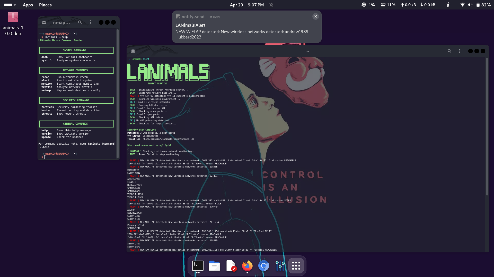
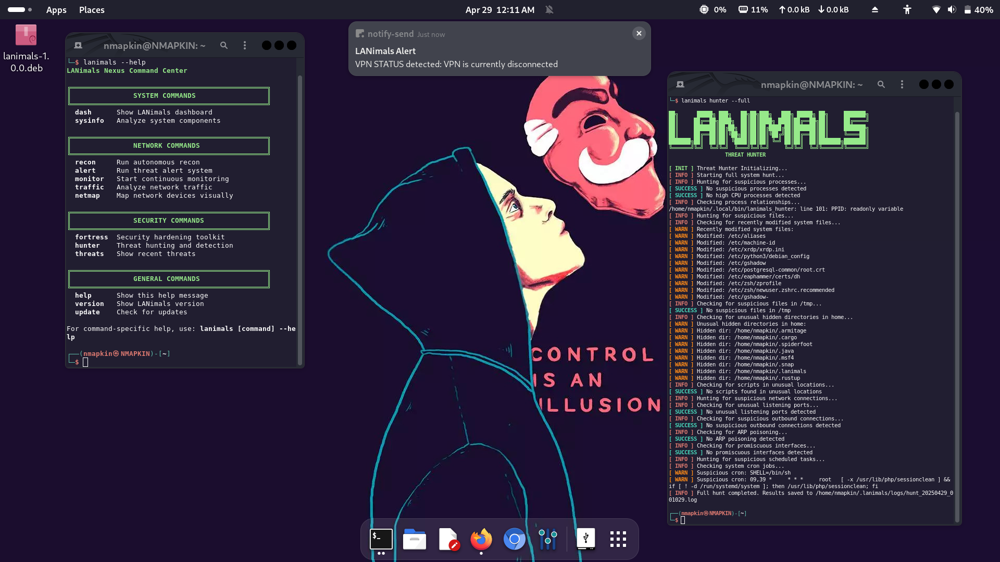
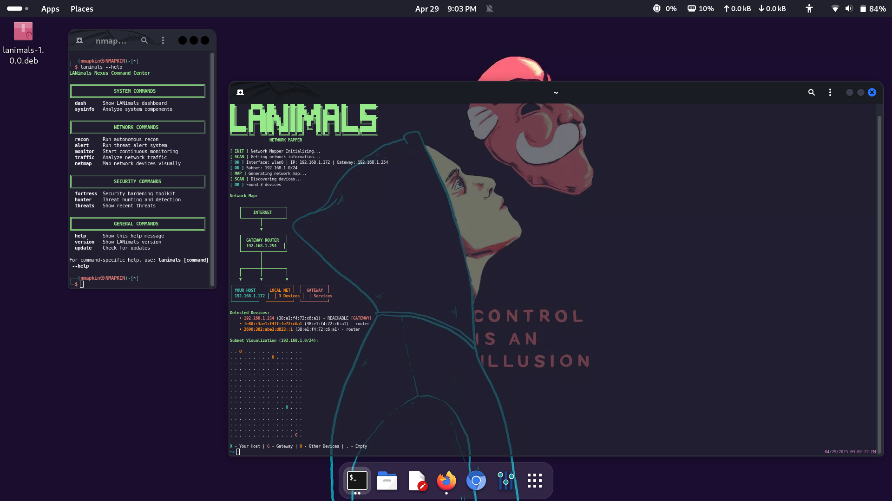
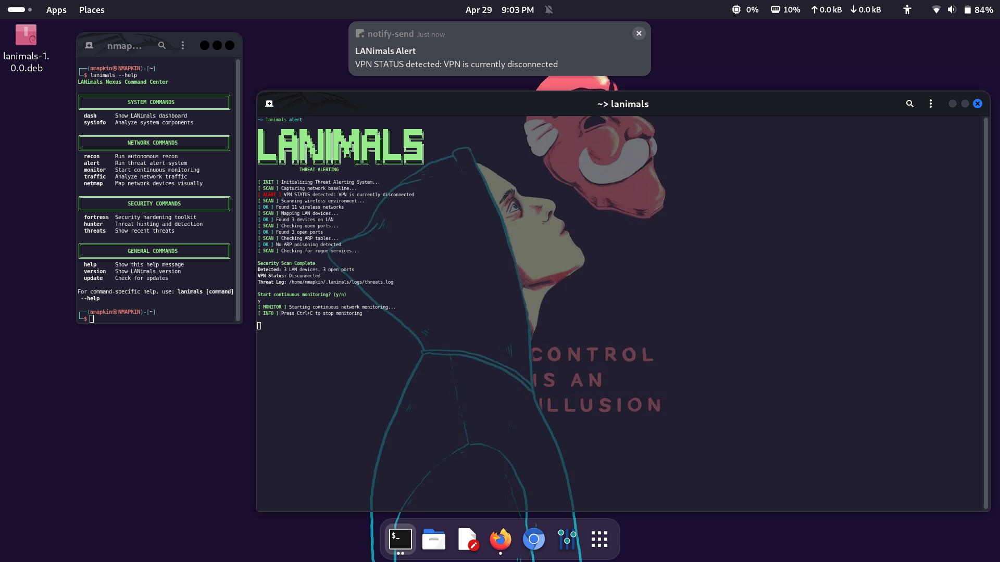
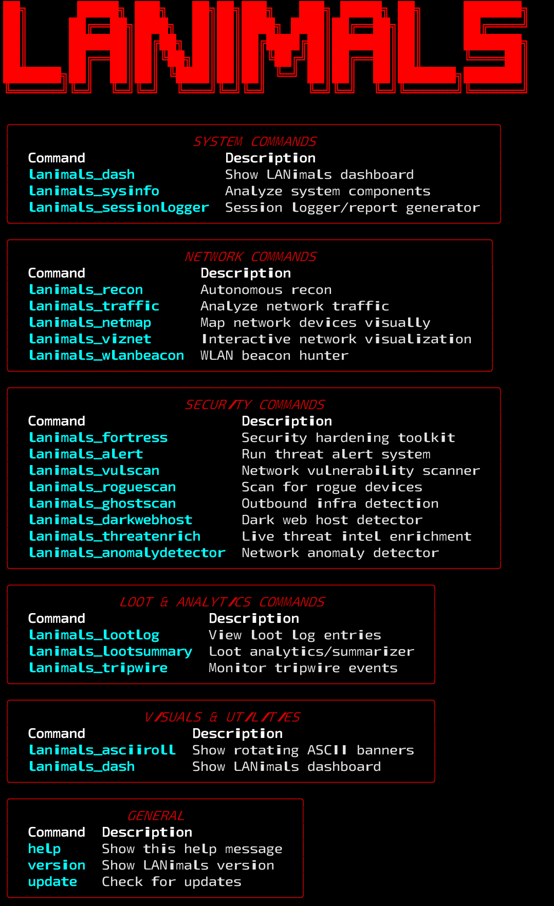

<p align="center">
  
</p>

<h1 align="center"><b>LANimals</b></h1>

<<<<<<< HEAD
<p align="center">
  <b>
    A next-gen network situational awareness and LAN threat hunting framework.<br>
    Modular. Scriptable. Battle-tested. All killer, no filler.
  </b>
</p>

---

<h2 align="center">FEATURES</h2>
=======
<p align="center"><i>
The next-gen, interactive LAN situational awareness & threat hunting toolkit for hackers, blue teams, and security pros.
</i></p>

---

## 🚩 Features at a Glance

- ASCII CLI dashboards and subnet mapping
- Real-time network/host recon, alerting, and anomaly detection
- Modular command suite—see below!
- Unique, gritty style with serious capabilities
>>>>>>> b4f0c30 (Polished DEF CON-style README with new assets)

---

## 📟 Command Overview

<!-- (Replace this image with a real one when you have it) -->
<p align="center">
<<<<<<< HEAD
  • Autonomous LAN recon & mapping<br>
  • Advanced ARP, port, and service fingerprinting<br>
  • Real-time traffic tap & analysis<br>
  • Threat surface & rogue device detection<br>
  • Loot logging, summary, and analytics<br>
  • GhostScan: Outbound infrastructure detection<br>
  • Anomaly detection & live threat enrichment<br>
  • Session logging, reporting, and export<br>
  • WLAN beacon hunting<br>
  • Dark web host detection<br>
  • And a lot more...
=======
  
>>>>>>> b4f0c30 (Polished DEF CON-style README with new assets)
</p>

---

<<<<<<< HEAD
<h2 align="center">CLI COMMANDS</h2>
=======
## 📸 Screenshots
>>>>>>> b4f0c30 (Polished DEF CON-style README with new assets)

<p align="center">
  
</p>
<p align="center">
  
</p>
<p align="center">
  
</p>

---

<<<<<<< HEAD
<p align="center">
  <b>Clone & Install in Seconds</b>
</p>

```sh
git clone https://github.com/GnomeMan4201/LANimals.git
cd LANimals
pip install -r requirements.txt
./install.sh
=======
## 🎬 Demo Video

- [LANimals Demo 1 (mp4)](assets/lanimals_demo1.mp4)

---

## 💎 Why Use LANimals?

- **Native ASCII dashboards:** Classic hacker visual feel
- **Menu-driven & modular:** Pick your tool or run them all
- **Real-world recon & hunting:** Built for blue/red team ops
- **Cross-platform:** Works on Kali, Linux, Termux

---

## ⚡ Quick Start

```bash
git clone https://github.com/GnomeMan4201/LANimals.git
cd LANimals
pip install -r requirements.txt
./lanimals_dash


---

📖 Documentation

For full module help, run:

./lanimals --help


---

🧰 Requirements

Python 3.7+

pip install -r requirements.txt


---

🤝 Contributing

PRs, bug reports, and feature suggestions are welcome!
See CONTRIBUTING.md for details.


---

⚠️ Disclaimer

This tool is for educational and authorized use only.
The author assumes no responsibility for any misuse.


---

<p align="center"><sub>
LANimals is © GnomeMan4201 — Inspired by classic hacker culture.<br>
Art & branding by GnomeMan4201.
</sub></p>
>>>>>>> b4f0c30 (Polished DEF CON-style README with new assets)
