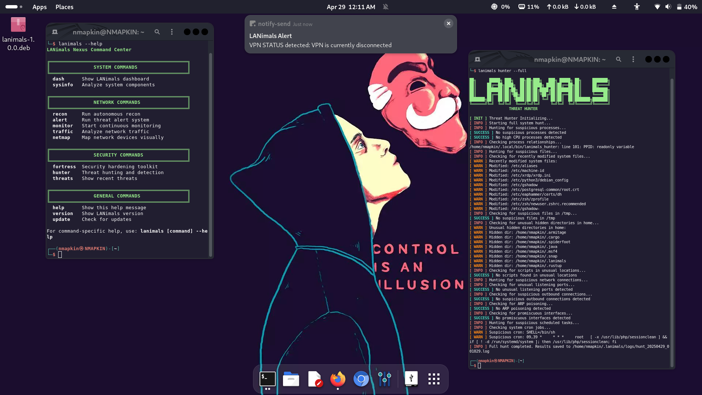

<p align="center">
  
</p>


---

Here’s a sneak peek of LANimals in action:

| Network Recon | Threat Hunter |
|----------------|----------------|
|  |  |

> Full threat-hunting automation, real-time notifications, and local system awareness — all in one command-line hub.

---

<h1 align="center">LANimals</h1>

> **LANimals** is a modular LAN recon and threat mapping suite  stylized terminal ops meet real signal.
> Passive detection, rogue host tracking, session logging, loot visualization, and more.

---

## Features

-  Intelligent LAN Sweep
-  Rogue Host Detection
-  Passive ARP Monitoring
-  Threat Grid Visualization
-  Loot Viewer (Artifacts, Logs, Recon Cache)

---

## Quickstart

```bash
git clone https://github.com/GnomeMan4201/LANimals
cd LANimals
bash install.sh
lanimals
