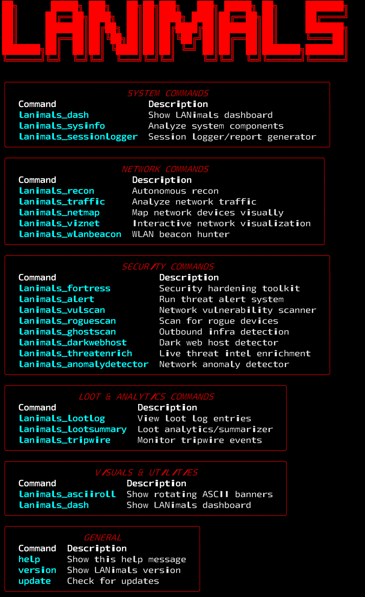

# LANimals

Lightweight network analysis and monitoring tool focused on LAN and Wi-Fi environments.

---

## Features
- Real-time network traffic capture
- Device discovery on LAN
- Wi-Fi signal strength monitoring

---

## Installation

Clone and setup:

    git clone https://github.com/GnomeMan4201/LANimals.git
    cd LANimals
    pip install -r requirements.txt

---

## Usage

Run the main script to start network monitoring:

    python lanimals.py

---

## Assets Preview

---

## Logo

---

## Legal Disclaimer

These tools are intended strictly for authorized research, security testing, and educational purposes. Unauthorized use is prohibited. You are responsible for compliance with all applicable laws and regulations.
