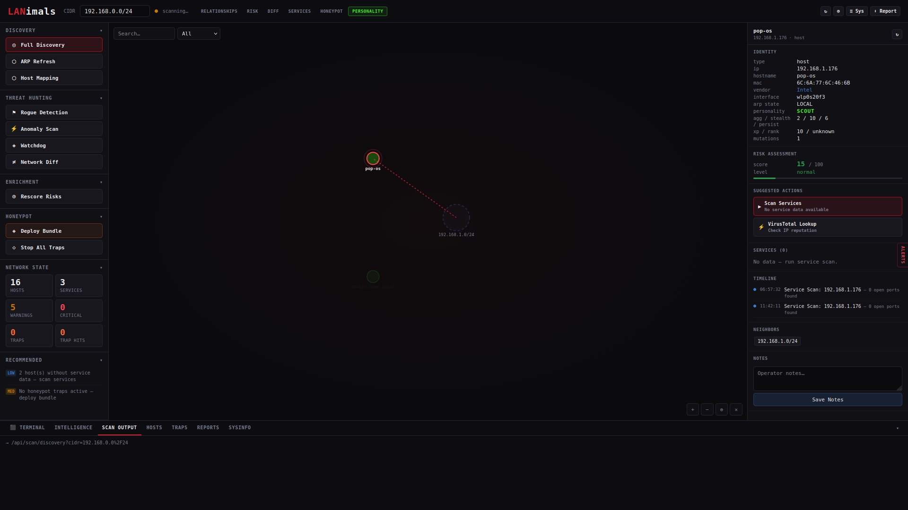

<p align="center">
[](https://github.com/GnomeMan4201/LANimals/actions/workflows/ci.yml)

  
</p>

# LANimals

**Local network intelligence platform — self-hosted, operator-grade, terminal-native.**

[](LICENSE)
[](#)
[](https://github.com/GnomeMan4201/LANimals/releases)

---

LANimals is a network intelligence platform that runs on your machine. It scans your LAN, tracks every device it finds, builds a MAC address baseline, flags rogue devices, fingerprints services, and renders everything as a live force-directed graph in your browser.

nmap tells you what's there right now. LANimals tells you what changed, what's new, what's suspicious — and keeps the history so you can prove it.

---


*Personality overlay mode — hosts assigned behavioral profiles (scout/mimic/parasite/leech) based on risk signals. Force-directed graph with live risk scoring and per-host investigation panel.*

---

## Requirements

- Python 3.10+
- Linux (Pop!_OS / Ubuntu tested)
- nmap: `sudo apt install nmap`
- Optional: `export VT_API_KEY=your_key` for VirusTotal enrichment

---

## Install
```bash
git clone https://github.com/GnomeMan4201/LANimals.git
cd LANimals
pip install -r requirements.txt
sudo apt install nmap
```

## Run
```bash
bash lan.sh
```

Opens at `http://127.0.0.1:8080` — auto-launches browser and starts background ARP refresh.

---

## Operations

| Operation | What runs |
|---|---|
| Discovery Scan | nmap ping sweep + ARP + interface enumeration |
| ARP Refresh | Fast `ip neigh` pull, instant graph update |
| Host Mapping | nmap with full hostname resolution |
| Rogue Detection | MAC baseline comparison — flags new/changed devices |
| Inventory | Local system: CPU, RAM, disk, interfaces |
| Anomaly Scan | Live outbound connection scoring |
| Service Scan | nmap -sV per host, stored in DB |

---

## Interface

- Force-directed canvas graph with physics simulation
- Click any node to inspect identity, MAC/vendor, services, risk, timeline, and notes
- Hosts tab, Events tab, Sysinfo tab
- VirusTotal enrichment via `VT_API_KEY`
- One-click HTML network report export

---

## API
```
GET  /api/health
GET  /api/graph
GET  /api/hosts
GET  /api/hosts/{ip}/services
GET  /api/hosts/{ip}/events
GET  /api/events
GET  /api/sysinfo
GET  /api/export/report
POST /api/scan/discovery?cidr=X
POST /api/scan/arp
POST /api/scan/rogue?cidr=X
POST /api/scan/services/{ip}
POST /api/hosts/{ip}/notes
```

---

*LANimals // badBANANA research // GnomeMan4201*
