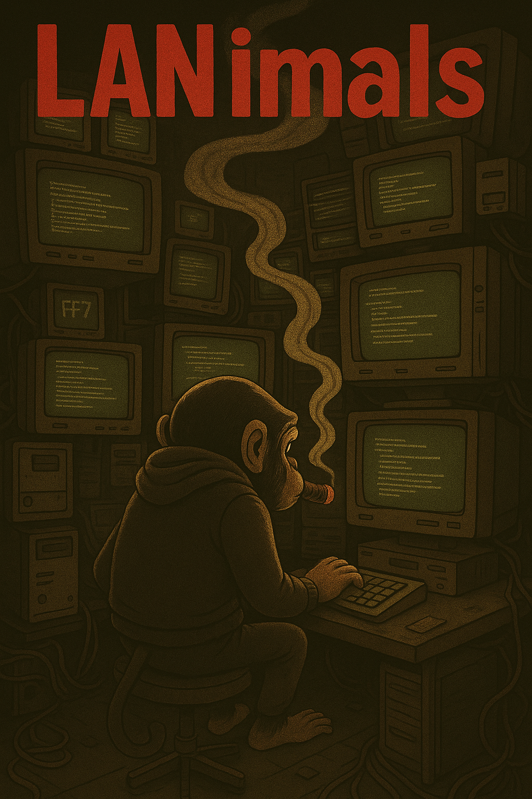
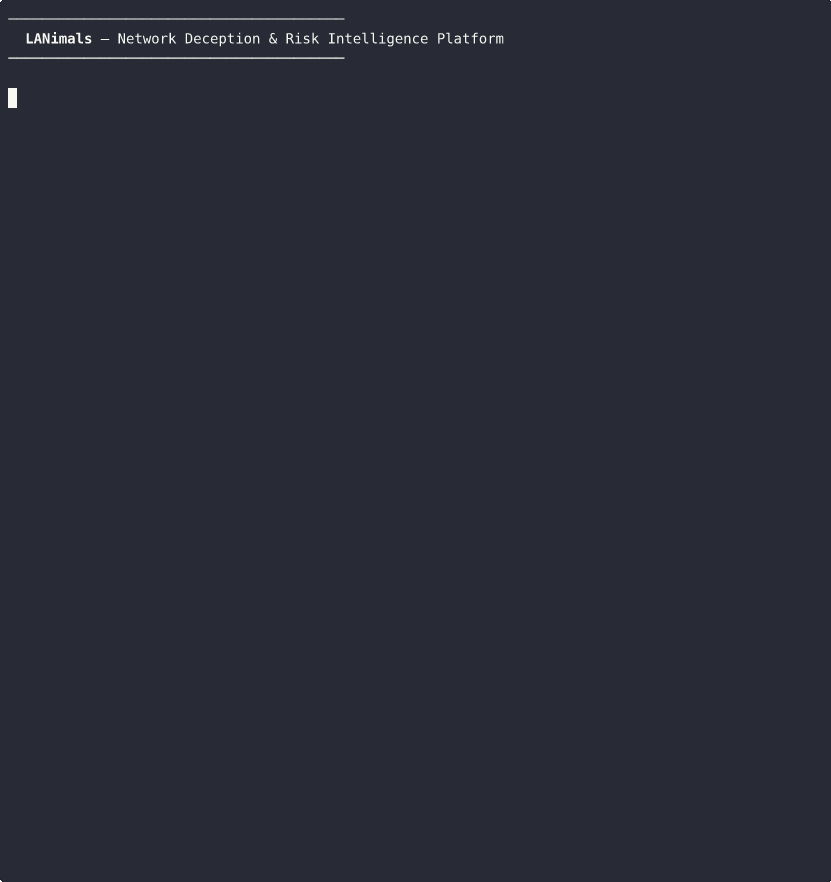
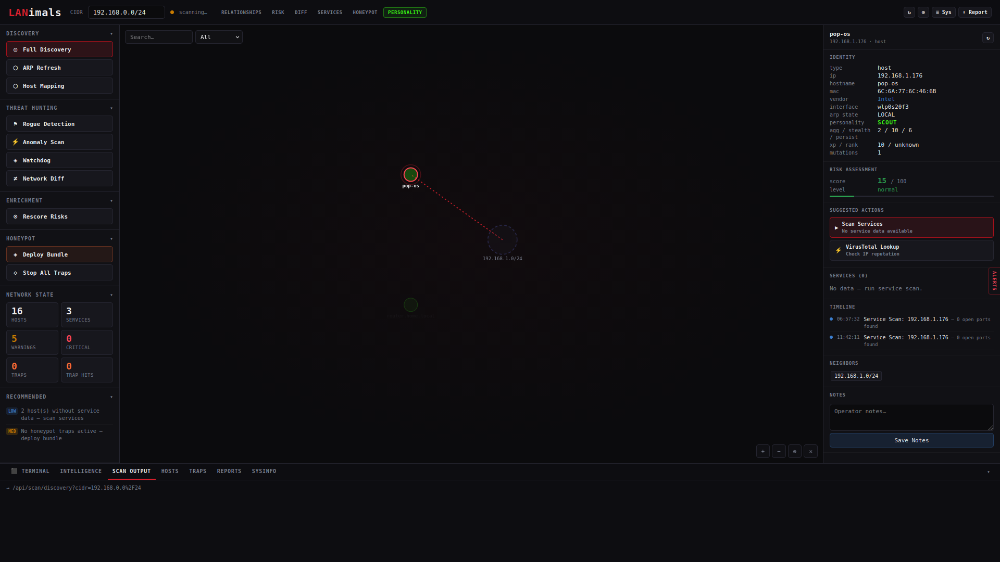

[](https://github.com/GnomeMan4201/LANimals/actions/workflows/ci.yml)

<p align="center">
  
</p>

# LANimals

**Local network intelligence platform — self-hosted, operator-driven, terminal-native.**

LANimals discovers devices inside an explicitly approved private LAN scope, keeps durable host/service/event history, surfaces identity changes for review, fingerprints services, scores explainable risk signals, and exposes the resulting state through a local browser console and CLI.

The supported product is the **self-hosted LANimals appliance**. The public/hosted site is a representative workflow surface only: a normal hosted browser cannot directly inspect a visitor's LAN, so hosted mode never claims that it can.

[](LICENSE)
[](#)
[](VERSION)

## What is real today

| Capability | Self-hosted appliance | Hosted site | Notes |
|---|---:|---:|---|
| Approved-scope LAN discovery | Yes | No | nmap, ARP, interface enumeration |
| Host map / inventory | Yes | Representative only | Persistent locally in SQLite |
| New or changed MAC detection | Yes | Representative only | Changes require explicit accept/defer review |
| Service fingerprinting | Yes | No | Scoped to an approved host |
| CVE correlation | Yes | No | nmap vulners correlation on approved hosts |
| Explainable host risk scoring | Yes | Representative only | Heuristic triage, not behavioral attribution |
| Host notes, events, baseline history | Yes | Session-only demo state | Durable locally |
| HTML operator report | Yes | Representative only | Generated from local evidence state |
| VirusTotal IP enrichment | Optional | No | Requires operator-supplied `VT_API_KEY` |
| Operating-system shell in browser | **No** | **No** | Browser terminal is an allowlisted LANimals command bridge |

The machine-readable source of truth is [`capabilities.json`](capabilities.json). CI checks that contract against the supported runtime, routes, command grammar, evidence paths, version, and hosted-demo boundary.

## Demo

```bash
./scripts/demo.sh
```





*Personality overlay mode assigns heuristic interface labels such as scout, mimic, parasite, and leech from configured risk signals. These labels are triage aids, not claims about device intent or behavior.*

## Requirements

- Linux; Pop!_OS / Ubuntu are the tested path
- Python 3.10+
- `python3-venv`
- `nmap`
- `iproute2`
- optional `VT_API_KEY` for VirusTotal enrichment

Install system requirements on Debian/Ubuntu-family systems:

```bash
sudo apt install python3-venv nmap iproute2
```

## Install

```bash
git clone https://github.com/GnomeMan4201/LANimals.git
cd LANimals
./install.sh
```

`install.sh` creates an isolated `.venv` inside the checkout and links the checkout-aware LANimals commands into `~/.local/bin`. It refuses to overwrite a real file already using one of those command names.

LANimals is intentionally **checkout-first**. The CLI, browser UI, assets, runtime, and local appliance lifecycle are operated together, so `pip install .` is not advertised as a supported installation path.

For unattended installation with an explicit scope:

```bash
./install.sh --scope 192.168.1.0/24
```

## First run

LANimals fails closed until an approved private network scope exists.

```bash
lanimals setup
# or explicitly:
lanimals setup 192.168.1.0/24

lanimals doctor
lanimals start
```

The local browser console is served at:

```text
http://127.0.0.1:8080
```

Starting the appliance does **not** automatically scan the network. Collection begins only after an operator action.

Useful lifecycle commands:

```bash
lanimals status
lanimals open
lanimals config
lanimals stop
```

The dispatcher resolves its own checkout, so these commands can be run from any working directory after installation.

## Supported operator path

The supported v2.1 operator path is the local appliance plus its scoped collectors and persistent evidence store.

```text
approved private CIDR
        │
        ▼
 scoped collectors
 nmap / ARP / host map / services
        │
        ▼
 normalization + SQLite evidence
        │
        ├── events / baseline review
        ├── services / notes / history
        └── explainable risk scoring
        │
        ▼
 FastAPI operator boundary
        │
        ├── local browser console
        └── allowlisted terminal bridge
```

Primary operations:

| Operation | Runtime behavior |
|---|---|
| Discovery | nmap ping sweep + ARP + local interface enumeration |
| ARP refresh | Pull current neighbor state and refresh the graph |
| Host map | nmap host mapping with hostname resolution |
| Rogue/baseline review | Compare current MAC observations with accepted baseline state |
| Service scan | nmap service/version fingerprinting for an approved host |
| CVE correlation | nmap vulners correlation for an approved host |
| Inventory | CPU, RAM, disk, and interface information from the local system |
| Anomaly scan | Score live outbound connection observations |
| Report export | Render the current local evidence state as HTML |

## Browser interface

The self-hosted interface includes:

- force-directed network graph
- per-host identity, MAC/vendor, service, risk, timeline, and notes views
- hosts, events, and system-information views
- explicit baseline accept/defer decisions with an audit trail
- local HTML report export
- optional VirusTotal enrichment
- honest empty state by default

Synthetic graph data is available only when explicitly enabled with:

```bash
LANIMALS_DEMO_MODE=1 lanimals start
```

## Security and scope boundaries

LANimals is designed to make the collection boundary visible rather than implicit.

- Scan targets must resolve inside the approved private CIDR.
- The appliance binds to `127.0.0.1:8080` by default.
- A non-loopback bind is refused unless both `LANIMALS_HOST` and `LANIMALS_ALLOW_REMOTE=1` are explicitly set.
- The browser terminal is an allowlisted LANimals command bridge, **not** an OS shell.
- State-changing API requests require `X-LANimals-Operator: 1`.
- That header is a localhost/cross-site request boundary; it is not remote-user authentication.
- If remote access is required, put LANimals behind authenticated network access rather than treating the operator header as authentication.

See [`SECURITY.md`](SECURITY.md) for the security policy and reporting guidance.

## Data and evidence locations

LANimals separates durable evidence, configuration, logs, and disposable scan state using XDG paths:

```text
${XDG_CONFIG_HOME:-~/.config}/lanimals/config.json
${XDG_DATA_HOME:-~/.local/share}/lanimals
${XDG_STATE_HOME:-~/.local/state}/lanimals
${XDG_CACHE_HOME:-~/.cache}/lanimals
```

The SQLite evidence store and durable state remain outside the checkout. Moving, replacing, or updating the repository does not move or delete that evidence.

On the first v2.1 start, LANimals can non-destructively import supported v2.0 checkout-relative state when the new XDG destination is empty. Legacy files are left untouched as a recovery copy.

## API

The browser console uses the same local API boundary exposed by the appliance. Important route groups include:

```text
GET  /api/health
GET  /api/scope
GET  /api/graph
GET  /api/hosts
GET  /api/events
GET  /api/sysinfo
GET  /api/baseline
GET  /api/jobs/{id}
GET  /api/export/report

POST /api/scan/discovery
POST /api/scan/arp
POST /api/scan/hostmap
POST /api/scan/rogue
POST /api/scan/services/{ip}
POST /api/scan/inventory
POST /api/scan/anomaly
POST /api/scan/cve/{ip}
POST /api/scan/rescore

PATCH /api/hosts/{ip}/notes
POST  /api/baseline/accept
POST  /api/baseline/defer
```

`capabilities.json` is authoritative when documentation and implementation disagree.

## Legacy research modules

LANimals predates the current appliance architecture. Several standalone alerting, traffic, visualization, fortress, hunting, and advanced research scripts are intentionally preserved for lineage and experimentation.

They are **not** automatically promoted to supported appliance capabilities merely because a CLI wrapper still exists. Their status is `experimental_legacy` until they are brought behind the same scope, persistence, error-handling, and automated-test contracts as the v2.1 operator path.

This distinction is deliberate: the repository should never imply that an old experiment has the same support level as a machine-checked appliance capability.

## Validation

CI runs on Python 3.10 with the required Linux network tooling and executes both the automated test suite and appliance smoke test:

```bash
pytest tests/ -v --tb=short
bash scripts/smoke_appliance.sh
```

The smoke path verifies the local browser-appliance lifecycle in addition to unit and contract coverage.

## Capability contract

[`capabilities.json`](capabilities.json) defines three explicit states:

- `implemented_tested` — supported runtime behavior with automated contract coverage
- `implemented_local_runtime` — implemented but dependent on the local Linux/network environment or optional credentials
- `experimental_legacy` — preserved research code outside the supported operator path

That file is the boundary between what LANimals **does**, what requires the local appliance, and what remains research lineage.

---

*LANimals // badBANANA research // GnomeMan4201*
