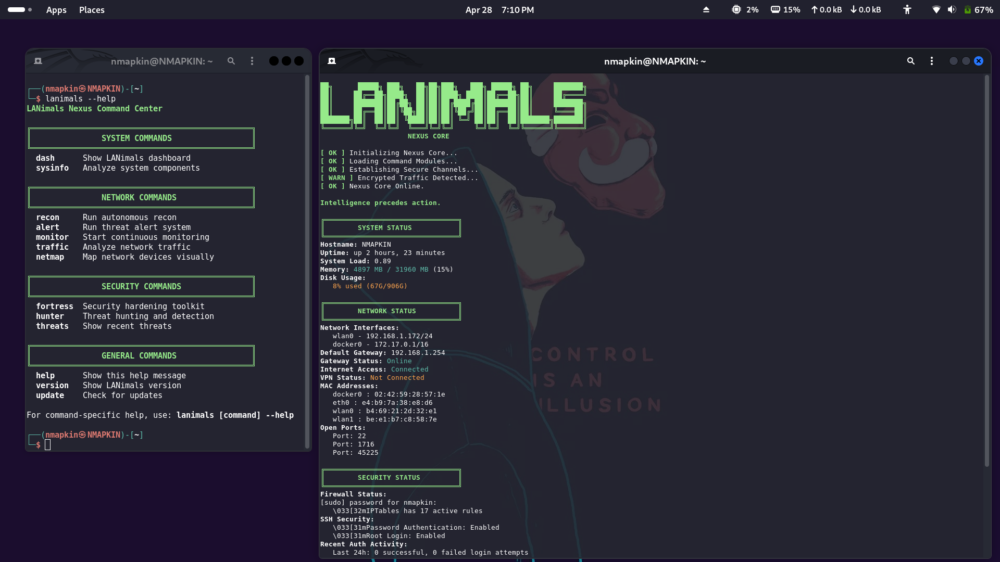

README.md
# LANimals

LANimals is a network reconnaissance, security auditing, and monitoring toolkit built to automate LAN mapping, traffic analysis, system hardening, and threat detection from a unified command center. Designed for Kali Linux and other security-focused distributions.


## 📸 Screenshots

### 🔍 Threat Hunter View


### 🌐 Visual Network Map


### 🧠 System Info Output


### 📊 Traffic Analysis


### 🛰️ Recon Output


## Features

- Network reconnaissance and device discovery
- System and service analysis
- Continuous LAN monitoring and threat alerts
- Traffic capture and protocol analysis
- Security auditing with recommendations
- Visual network mapping with ASCII art

## Installation

### From Source
```bash
git clone https://github.com/GnomeMan4201/LANimals.git
cd LANimals
sudo apt install dos2unix    # One-time install (required!)
dos2unix bin/*               # Fix line endings if needed
sudo make install
